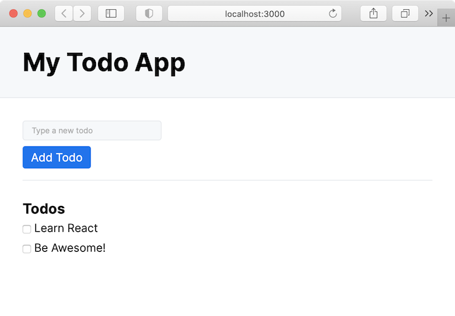

# Day 1: Getting Started with React

## Today's Learning Objectives

Today's goal is to set up the structure of our application and end up with a basic, static page.

## Your Mission

### Step 1. Installation

Create a folder for this project (I suggest you call it `intro-react`). Inside this folder, type the following command:

`npx create-react-app .`

_Don't forget the ending period!_

The installation may take a few minutes. At the end you will see a recap in your terminal with a few commands you now have available. The most important ones are:

1. `npm start` (or `yarn start` if you prefer **yarn** to **npm**) is the command you will use every time you work on the application locally - it will start a local server, do a bunch of magics, and provide the application at the address: `http://localhost:3000`
2. `npm run build` (or `yarn build` if you prefer **yarn** to **npm**) will create the production-ready application files inside a folder called `build` (this is the folder that you can drop in Netlify)

### Step 2. Git

I shouldn't be saying it but... `git init`, commit, push etc.!

The cool thing is that `create-react-app` generates a `.gitignore` file for you so that you only commit the necessary files (never commit the `node_modules` folder, for example).

### Step 3. Start! And code...

Run:

`npm run start`

and watch the magic happen (your browser should self-open at `http://localhost:3000`). Yay!

Try to change something in the file `App.js`. For example, change the line that says

`Learn React`

to

`Learn React @ BeCode`

and save. The browser will immediately reload with the new version. Isn't that cool?

### Step 4. Time to do some real work

Up until now, you have been served everything. It's time to code.

Your goal for today is to create the components that form the app. You are creating a static skeleton with a fixed list of todos. Tomorrow we will see how to make it interactive. Here is what it should look like, structure-wise:

Note: it doesn't have to look _identical_ (I used the [new.css](https://newcss.net/) CSS framework by the way, in case you are interested), but it does have to have the following features:

- an input field to type new todos
- a submit button
- a list of todos (just add 2-3 todos)
- each todo has a checkbox next to it

Make sure that you:

- create different React components for the various parts (the list above is a BIG help in how to structure your components \*wink wink\*)
- place every component in a different file (the convention is that the filename is equal to the component name), and use the `import`/`export` syntax to import them into the `App.js` file

### Step 5.

Done?

If you think you are done, push your changes to GitHub, build and deploy the app on Netlify, and ping your coach on Discord so that he/she can check the code you wrote.

## Good Luck!
